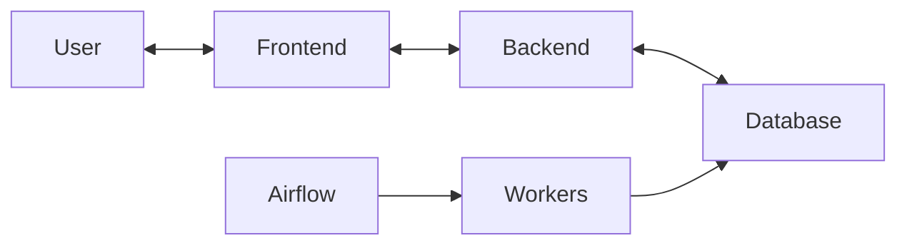
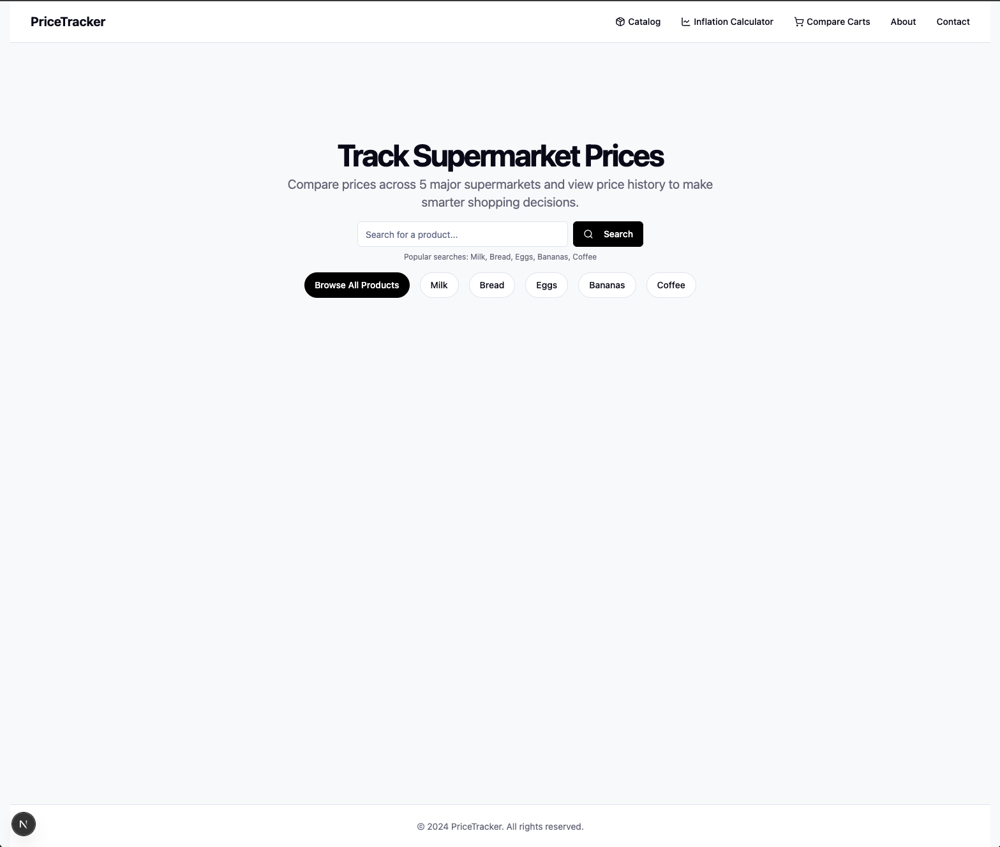
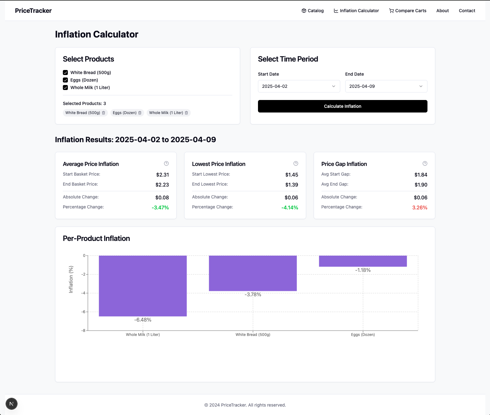
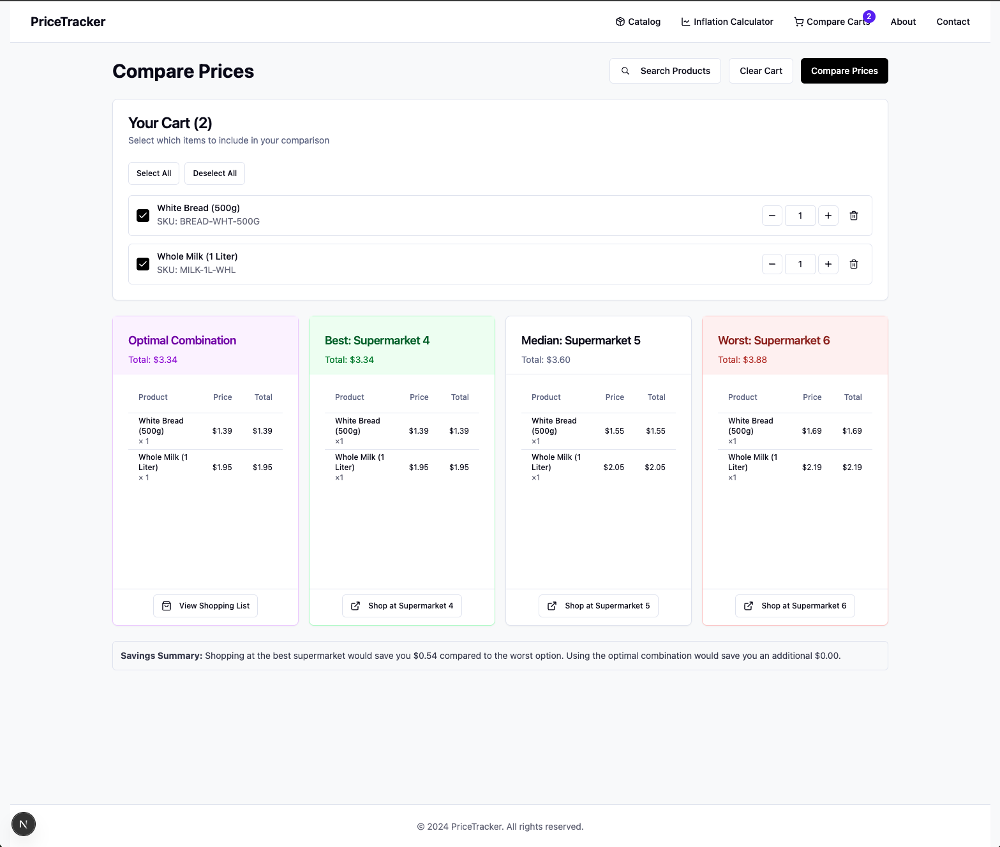
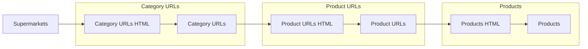

# Supermarket.py
A project that scrapes data from paraguayan supermarkets.

## Architecture
* Frontend (`next.js`)
* Backend (`fastapi`)
* DB (`postgres`)
* Pipeline (`airflow`)



## Screenshots









## Install
Use [`neon`](https://neon.tech/) as a `postgres` database. Create an account and use connection string:
```
postgresql://my_user:my_password@***-***.us-east-2.aws.neon.tech/my_database?sslmode=require
```

Deploy frontend to [`vercel`](http://vercel.com/) and get `FRONTEND_URL`.

Modify `.env` file:
```
POSTGRES_USER='postgres'
POSTGRES_PASSWORD='password'
POSTGRES_HOST='localhost'
POSTGRES_PORT='5432'
POSTGRES_DB='supermarket'

BACKEND_PORT='8000'
FRONTEND_URL='something.com'

PIPELINE_HOST='localhost'
PIPELINE_PORT='6789'
```

Build and run with `docker`:
> [!NOTE]  
> Make sure to have the correct `.env` file when running docker compose
> `docker compose -env_file ./env.dev -f [...]` won't work because it won't perform substitution at compose time

```sh
# local development
docker compose -f docker-compose-dev.yaml build && docker compose -f docker-compose-dev.yaml up
```

```sh
# production deployment
docker compose -f docker-compose-prod.yaml build && docker compose -f docker-compose-prod.yaml up
```

```sh
# run pipeline
cd pipeline/
astro dev start
```

## Important concepts



* `supermarkets`: table containing supermarket metadata
* `category_urls`: container with links to each category in the site
* `product_urls`: equivalent to a product list, go to each category page extract elements and go to next pagination link
* `products`: product information


## TODO:
* Upgrade containers to use `UV`

* New URLs:
    * https://supermercadolabomba.com/index.php?class=Inicio
    * https://losjardinesonline.com.py/
    * https://www.supermas.com.py/
    * https://kingo.com.py/index.php?class=Inicio
    * https://www.fortis.com.py/
    * https://grutteronline.casagrutter.com.py/
    * https://www.salemmaonline.com.py/

* Standarize URLs (https://www.supermas.com.py/), fully qualified urls:
    * https://
    * www.
    * .com.py/