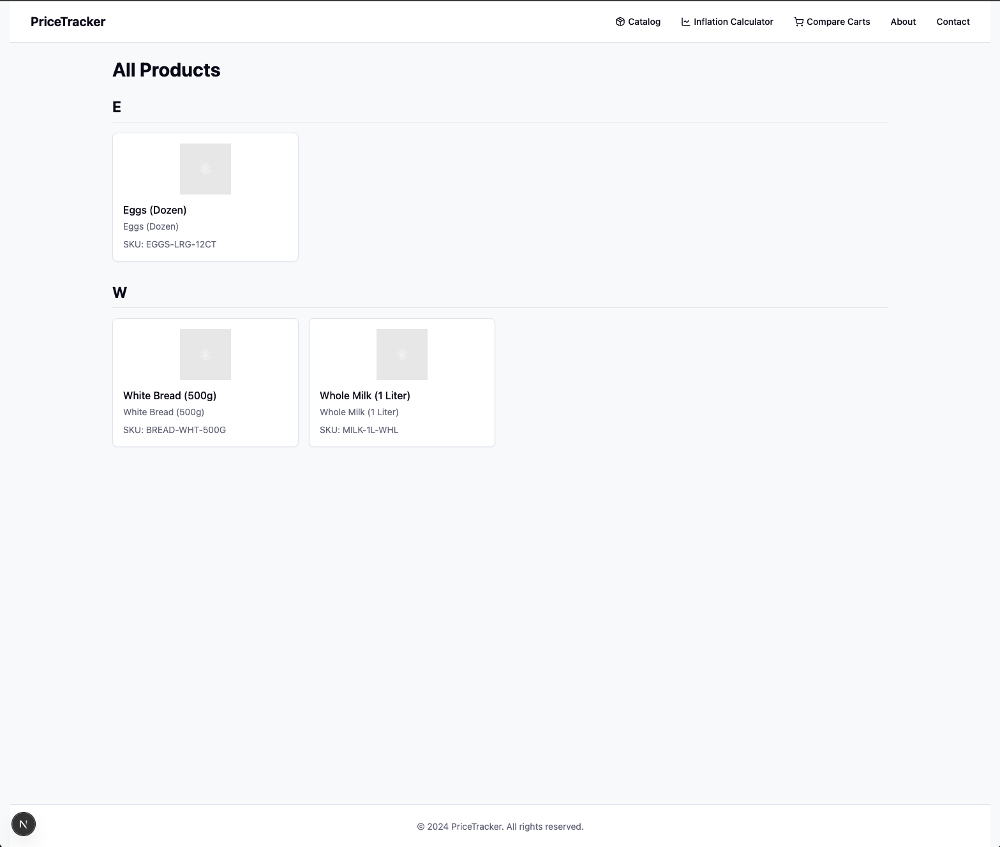

# Supermarket.py
A project that scrapes data from paraguayan supermarkets.

## Architecture
* Frontend (`next.js`)
* Backend (`fastapi`)
* DB (`postgres`)
* Pipeline (`mage.ai`)

## Screenshots





## Install
Make sure `run_app.sh` is executable:
```sh
chmod +x run_app.sh
```

Use [`neon`](https://neon.tech/) as a `postgres` database. Create an account and use connection string:
```
postgresql://my_user:my_password@***-***.us-east-2.aws.neon.tech/my_database?sslmode=require
```

Deploy frontend to [`vercel`](http://vercel.com/) and get `FRONTEND_URL`.

Modify `.env` file:
```
POSTGRES_USER='postgres'
POSTGRES_PASSWORD='password'
POSTGRES_HOST='localhost'
POSTGRES_PORT='5432'
POSTGRES_DB='supermarket'

BACKEND_PORT='8000'
FRONTEND_URL='something.com'

MAGE_DATA_DIR='/app'
LOCAL_MAGE_DATA_DIR='/home/user/your/directory'
PIPELINE_HOST='localhost'
PIPELINE_PORT='6789'
```

Build and run with `docker`:
```sh
# local development
docker compose --env-file .env.dev -f docker-compose-dev.yaml build && docker compose -f docker-compose-dev.yaml up
```

```sh
# production deployment
docker compose --env-file .env.prod -f docker-compose-prod.yaml build && docker compose -f docker-compose-prod.yaml up
```