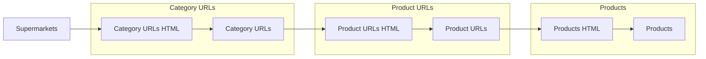

# Pipeline - Airflow

Start development server:
```sh
astro dev start
```

## Architecture
* `Category URLs`
    * www.superseis.com.py/categories/3-almacen
* `Product URLs`
    * www.superseis.com.py/products/banana
* `Products`
    * `{"description": "banana", "price": 3500, "sku": 004123412}`



## Redis Broker
Create a new connection:
```python
broker = Broker(redis_connection_id='my-redis')
broker.create_connection()
```

Create a new `xgroup` to write to:
```python
stream_name = 'transform_category_urls_stream'
group_name = 'product_db_inserters'

broker.create_xgroup(stream_name, group_name)
```

Read from `xgroup`:
```python
consumer_name = 'transformer'
broker.read(stream_name, group_name, consumer_name, 20, 1_000)
```

Write single entry `xgroup`:
```python
product_1 = {
    'supermarket_id': 1,
    'description': 'coca cola',
    'sku': '21341234',
    'price': 22,
    'url': 'hello.com',
    'created_at': datetime.now().isoformat()
}

# single entry
broker.write(stream_name, product_1)
```

Write multiple entries to `xgroup`:
```python
product_2 = {
    'supermarket_id': 1,
    'description': 'coca cola',
    'sku': '21341234',
    'price': 22,
    'url': 'hello.com',
    'created_at': datetime.now().isoformat()
}

# use pipeline
products = [product_1, product_2]
broker.write_pipeline(stream_name, *products)
```

## Database
Check database counts:
```sql
SELECT 'supermarkets' AS 'table_name', count(*) FROM supermarkets
UNION ALL
SELECT 'category_urls_html', count(*) FROM category_urls_html
UNION ALL
SELECT 'category_urls', count(*) FROM category_urls
UNION ALL
SELECT 'product_urls_html', count(*) FROM product_urls_html 
UNION ALL
SELECT 'product_urls', count(*) FROM product_urls 
UNION ALL
SELECT 'products_html', count(*) FROM products_html 
UNION ALL
SELECT 'products', count(*) FROM products;
```